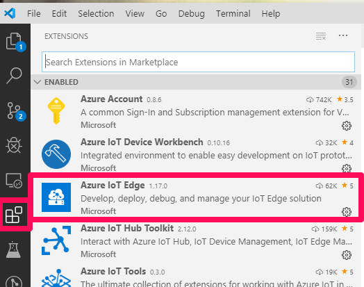
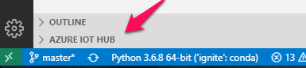
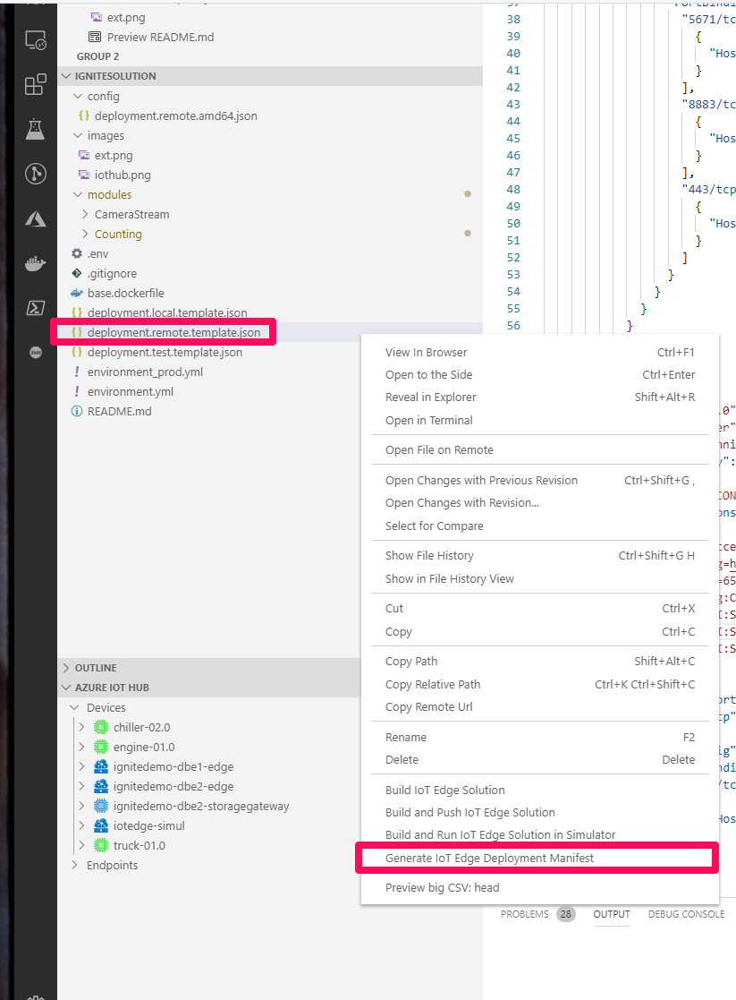
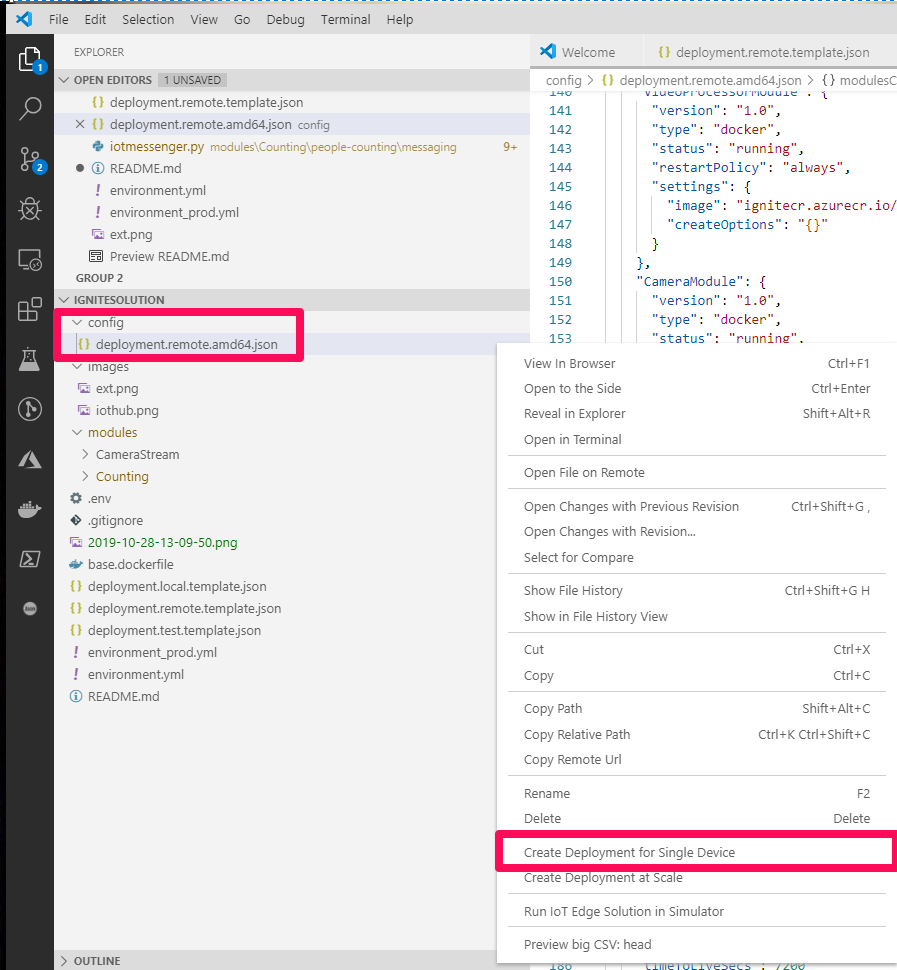
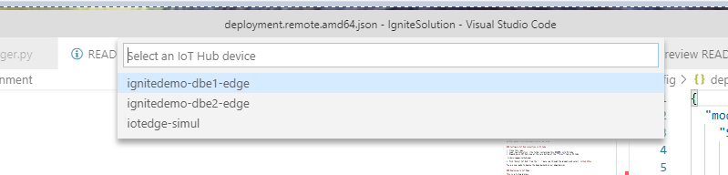

<!-- TOC -->

- [Ignite Containers Deployment Guide](#ignite-containers-deployment-guide)
  - [Prerequisites](#prerequisites)
    - [Click to Deploy](#click-to-deploy)
  - [Prerequisites](#prerequisites)
    - [Visual Studio Code](#visual-studio-code)
    - [Create Anaconda Environment](#create-anaconda-environment)
    - [Configure IoT Hub connection in VS Code](#configure-iot-hub-connection-in-vs-code)
    - [Deploying to IoT Edge](#deploying-to-iot-edge)
    - [Further Information and Troubleshooting](#further-information-and-troubleshooting)

<!-- /TOC -->

# Ignite Containers Deployment Guide

There are two methods that can be used for deployment. Click to deploy is the easiest and quickest. It is recommended to try this first.

## Method 1: Click to Deploy (Recommended)

### Prerequisites

1. [Az](https://docs.microsoft.com/en-us/powershell/azure/install-az-ps?view=azps-3.3.0) for PowerShell.
1. Az [azure-cli-iot-extention](https://github.com/Azure/azure-iot-cli-extension). Can be installed through this PowerShell command.
>> ```az extension add --name azure-cli-iot-ext```
3. [iotedgedev](https://github.com/Azure/iotedgedev). Can be installed through this command.
>> ```pip install iotedgedev==2.1.2```

### Deploy Modules

1. Click the "Edit_Env-Shortcut" icon located in this folder.
1. Enter the resource group and unique ID when prompted. The unique ID is a set of 5 unique characters generated for your deployment. It can be found attatched to many of the resources in your resource group as shown below.  


1. Click the "Deploy_Modules-Shortcut" icon located in this folder.
1. Provide your Azure subscription information when prompted.
1. Enter the name of the IoT hub created in [Deploy Azure Assets](Ignite/ARMtemps/README.md) instructions.

Modules should now be deploying.

## Method 2: Via Visual Studio Code

### Prerequisites

#### Visual Studio Code

1. Install [Visual Studio Code](https://code.visualstudio.com/)
1. Install [Azure IoT Tools](https://marketplace.visualstudio.com/items?itemName=vsciot-vscode.azure-iot-tools) extension

**Note:** You don't need to install iothubdev, docker, etc. They are not required for deployment. [VS Code and IoT Edge](https://docs.microsoft.com/en-us/azure/iot-edge/how-to-vs-code-develop-module) for more info



### Configure IoT Hub connection in VS Code

1. Clone this repo.
1. Load `IgniteSolution` (the folder containing this README) into VS Code
1. Expand Azure IOT Hub view at the very bottom of the **Files** tab in VS Code



2. Pick "Select IoT Hub" from the "..." menu, go through the prompts and select your IoT Hub name (Ex. `iothub-123ab`)

You are now ready to deploy the demo backend on our edge devices


### Deploying to IoT Edge

1. Obtain the [.env.template](IgniteSolution/.env.template) file, update it with your information, and save as `.env` at the root of this solution. This file contains expansions to the variables mentioned in the deployment template.

1. Generate Deployment manifest. This will generate a `deployment.remote.amd64.json` in the `config` directory:



2. Deploy to the right device by selecting the file generated in the previous step. **NOTE**: Do not right-click on the "template" file:





You are done!

### Further Information and Troubleshooting

Follow the [Counters and Gap Detection](docs/counters_and_gap_detection.md) guide for detailed information on calibrating counters and enabling gap detection.
