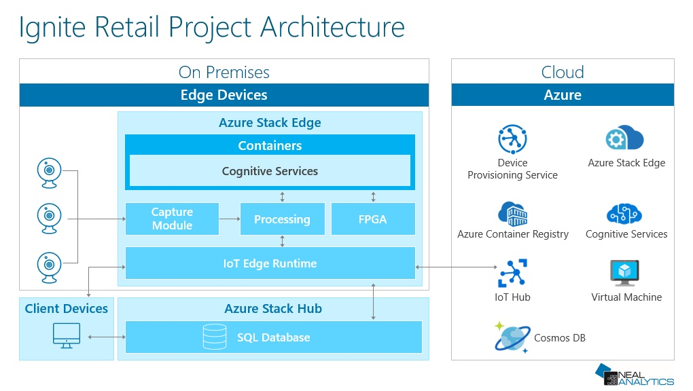

# Ignite Retail of the Future Demo

The demo consists of the containers deployed on Azure Stack Edge performing:

* Face detection
* Facial identification
* Speech-to-text and text-to-speech
* Speech analysis
* Distributed people counters
* Out-of-stock (empty shelf space) detection

## Setup Instructions
Please see [this guide](setup_instructions.md) for detailed instructions on setting up this solution.

## Other useful resources

For instructions on deploying these containers please see [Container Readme](IgniteSolution/README.md).

The UX used at Ignite is a consolidated application separated into several views enabling:

* Zone-sensitive FAQ display where the FAQ appropriate to the product is triggered by NFC once a "sales associate" moves to the RFID reader near the product.
* Welcome experience: runs on Surface Studio greeting a client once she is detected providing speech and text prompts and reacting to voice responses
* Checkout/customer registration experience: runs on Surface Go tablets, performs checkout and registers customers for repeat visits/promotions by initiating the face identification process. At this stage a customer picture is taken and featurized for further identification. No images are stored.
* Insights: shows how merchandise is moving, foot traffic dynamics through visual people counters, shelf gaps (out-of-stock) detection

See [UX Setup Guide](IgniteDemoApp/README.md) for more details on installing/running the demo UX.  
See [Container Setup Guide](IgniteSolution/README.md) for more on installing the containers enabling the demo.  
See [SQL DB Setup Guide](sql-backend/README.md) for details on setting up the Insights database.
